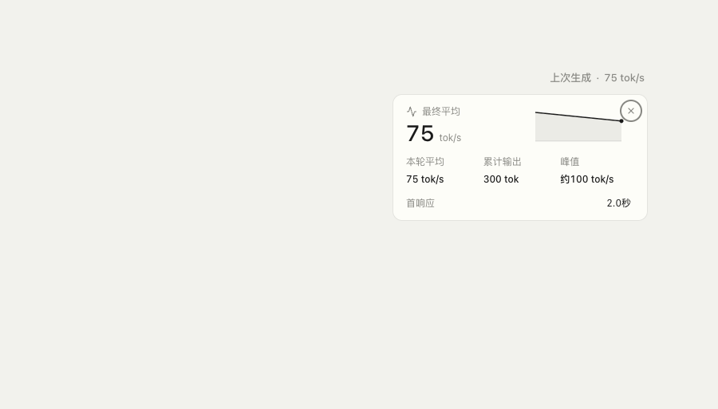
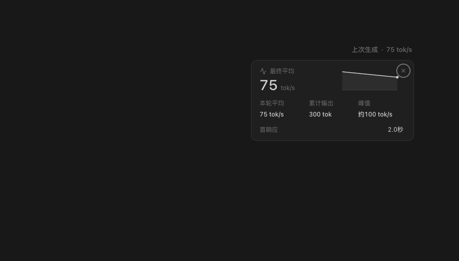

# 回复速度测量与展示

速度是展示投影，计费、缓存命中与上下文容量仍由引擎真实 usage 管理。流式速度不能回写
`UsageTracker`、账单或 token 余额。实现位于 `agents/shared/response-speed.ts`，两端复用
`maker-shared/usage-format` 的快照校验与图表模型。

## 计时边界

| 引擎 | 等待起点 | 首响应终点 | 校准来源 |
| --- | --- | --- | --- |
| Pi | 本地 `agent_start` | text / thinking / toolcall 的内容开始或首个 delta | 每条 assistant `message_end.usage.output` |
| Claude Code | SDK `message_start` | 主线 `content_block_start` 或 delta；子 Agent 独立 | 主线 `message_delta.usage.output_tokens` |
| Codex | 本地接受 `turn/started` | reasoning/tool item 开始或已去重文字 delta | 本轮真实 usage segments 的累计 output |

这些是本地可观测边界，包含思考和工具参数，不代表首个可见文字或网络 TTFT。
Claude 显示「流内等待」，SDK 暴露事件前的请求时间不可测。Pi/Codex 显示「首响应」。
排队发生在引擎开始前，不进入等待或生成速度。

生成计时从内容开始，到响应结束或工具/审批暂停；工具结束后要等到下一次内容才恢复。
Pi 重试关闭失败片段，下一请求重新等待；每轮重新清空测量。零 usage 是有效零；缺少 usage
则保留估算。仅结束事件有 output、没有可观测流，或检测到挂起/时钟异常时不提供 TPS。

## 实时与终态

- 字符加权估计避免把一个传输片段当一个精确 token。它跨分片可加，但仍不是 tokenizer。
- 最近 1 秒滑窗，Pi/Claude 最多每 250ms 推进；Codex沿用 500ms 状态节流。
  窗口最多 256 个聚合点，图表最多 60 个采样点，不保留文本。
- 实时速率、峰值及未校准输出标「约」。真实 usage 到达后校准该响应的曲线及输出；
  完成时显示真实输出除以已观测生成时间的最终平均。校准后的曲线和峰值仍是估计分配。
- 工具期间不冒充正在生成，当前速度为空；Pi 的 tool_execution、Codex 的配对 item 执行边界显示「执行工具中」，不能从参数流推出执行已开始。Claude 缺少同等执行事件时只标「生成暂停」；并行模型 delta 优先显示实际生成。下一请求重新显示等待响应。静默超过观测窗口显示「暂未收到新输出」；不把没有可见内容当真实零输出。远端快照的时间戳在接收端
  归一为本地观测时间，避免用两台机器的绝对时钟差延长等待或抹掉当前速度。
- 停止/终态错误可能没有最后一份 usage，冻结最后观测并保留估算标识。
- 原速度入口在完成后保留「上次生成」，点击/键盘可重开详情；不依赖 hover 或先 pin，
  不固定几秒后隐藏。下一轮用本轮等待替换，切换任务不把别的任务的数据搬过来。

## 回看与持久化

最新快照留在任务的进程内状态，切换任务或组件重新挂载可以回看；图表不写数据库。
应用/Renderer 重载后首响应和曲线不恢复。已有消息用量记录继续保存真实 output 与经过
计数匹配检查的生成 duration，支持历史最终平均 TPS；缺失或计数不匹配时省略 TPS。
不增加数据库 schema、migration 或首响应持久字段。

## 兼容与验证

`UsageSnapshot.responseSpeed` 是既有 status 的可选增量字段：旧主机缺省，新界面使用原
usage 算法；旧客户端忽略新字段。无新 IPC channel、服务端协议版本或移动端原生指纹。

事件序列验证见 `response-speed.test.ts`、`response-speed-adapters.test.ts`；
两端组件/任务状态验证覆盖工具暂停、完成保留、下一轮、停止、任务切换与旧主机兼容。
真实设备与离线受控事件截图必须分别记录，不把离线结果声称为真实模型吞吐。

## 组件验收画面

真实状态栏和速度卡，使用离线受控事件（2 秒首响应、300 输出、4 秒生成），并非真实模型
吞吐测量。两图分别加载完整 Cindy Light / Dark 主题；完成超过旧淡出时间后仍可点击查看。

